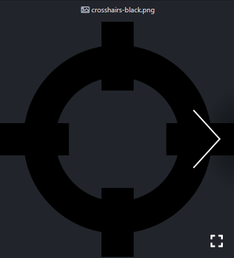

# Atom Files

View Mediafiles in Tabs

### supported Types:
- Images (.bmp, .gif, .ico, .jpeg, .jpg, .png, .webp)
- Videos (.mp4)
- Audio (.mp3)
- Embed (.pdf, .html)

Open a file as Preview and a Slideshow of all containing media in the folder will be created.

Use arrow keys to see the next/previous item, Space to Play/Pause and f/esc to toggle fullscreen

|Image Preview|MP3 Player|
|-|-|
|||

<!--
### TODO

config:

open file from same folder in active item

image:

- dobbleclick zoom
- ctrl + scroll zoom

files:

- array supported types
- opener: playlist
- opener: filter type
- opener: save
- opener: load

music:

- scroll playlist
-->
